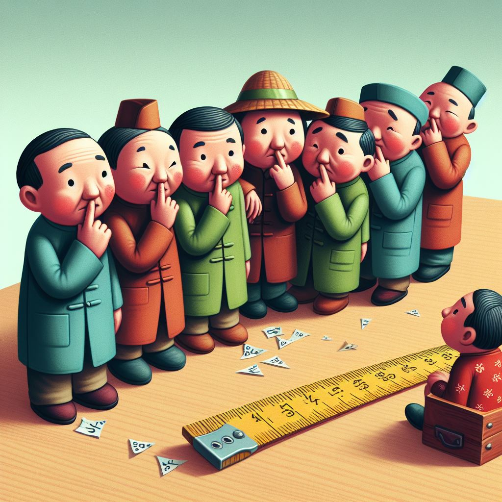
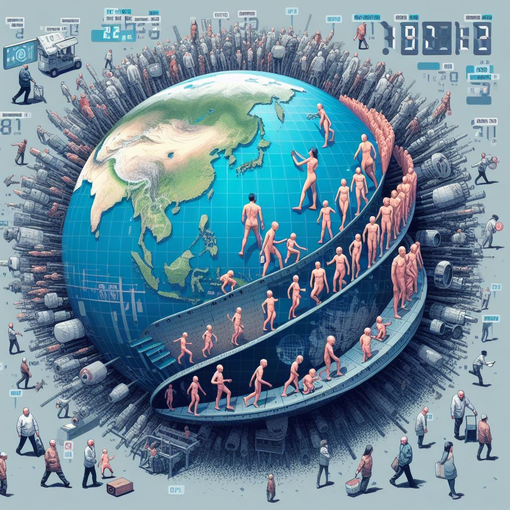
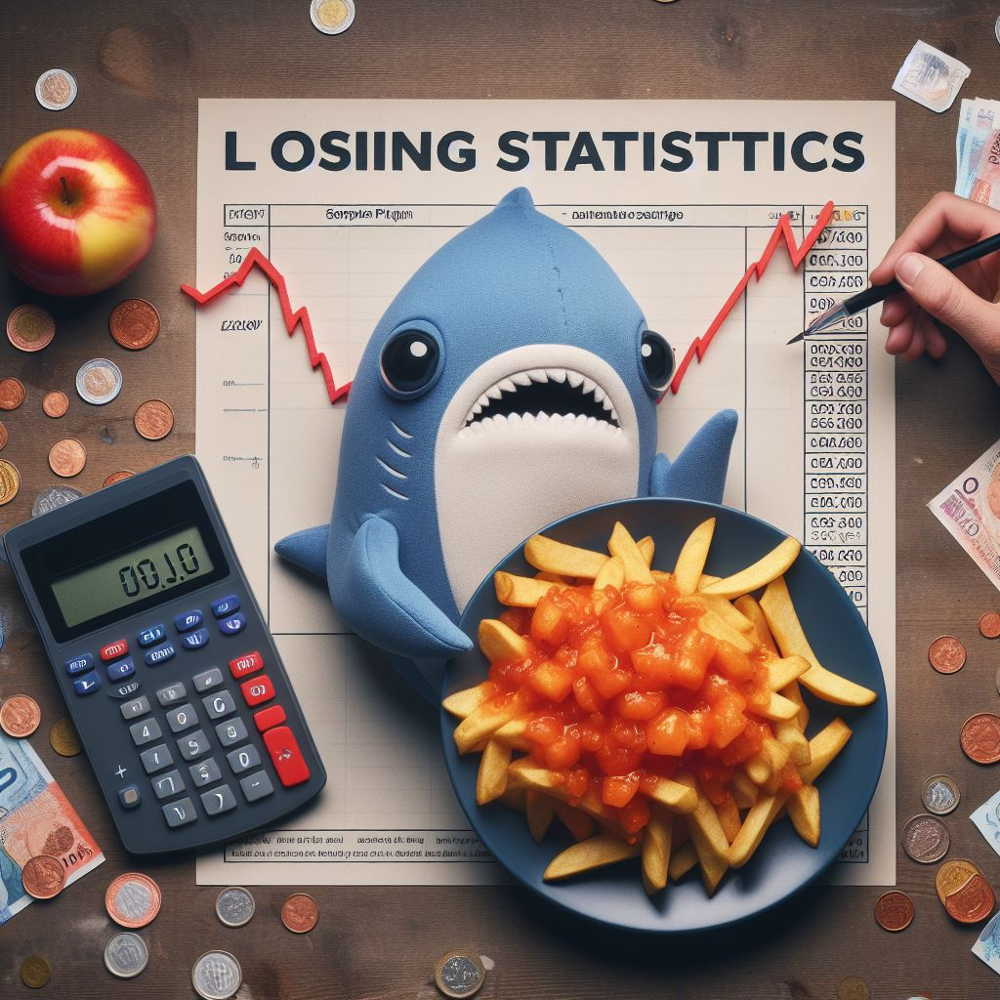
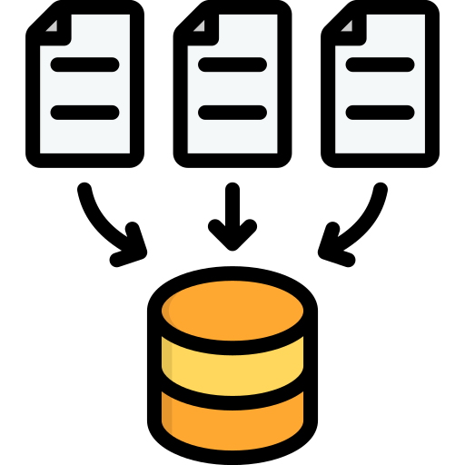

# References

## Images

| Image | File Name | Source Link | Preview |
|-------|-----------|-------------|---------|
| StoryTelling | 1-2-1-StoryTelling.jpeg | [Source Link](https://www.bing.com/images/create) |  |
| WhisperGame | 1-2-2-WhisperGame.jpeg | [Source Link](https://www.bing.com/images/create) |  |
| TailorSuit | 1-2-3-TailorSuit.jpeg | [Source Link](https://www.bing.com/images/create) |  |
| StockMarket | 2-2-1-StockMarket.jpeg | [Source Link](https://www.bing.com/images/create) |  |
| AirPollution | 2-2-2-AirPollution.jpeg | [Source Link](https://www.bing.com/images/create) |  |
| SocialMedia | 2-2-3-SocialMedia.jpeg | [Source Link](https://www.bing.com/images/create) |  |
| PopulationOverload | 2-3-1-PopulationOverload.jpeg | [Source Link](https://www.bing.com/images/create) |  |
| Inflation | 2-3-2-Inflation.jpeg | [Source Link](https://www.bing.com/images/create) |  |
| RossVenus | 3-1-1-RossVenus.jpeg | [Source Link](https://www.eliteleague.co.uk/article/1328-venus-confirmed-for-11th-season-at-skydome) |  |
| DataCollect | 3-2-1-DataCollect.png | [Source Link](https://www.flaticon.com/) |  |
| DataAnalysis | 3-2-2-DataAnalysis.png | [Source Link](https://www.flaticon.com/) |  |
| DataVisualize | 3-2-3-DataVisualize.png | [Source Link](https://www.flaticon.com/) |  |
| DecisionMaking | 3-2-4-DecisionMaking.png | [Source Link](https://www.flaticon.com/) |  |

## Charts

| Chart | Data Source |
|-------|-------------|
| Variability in A-Level mathematics results – summer 2020 vs. summer 2021 | [Data Source](https://analytics.ofqual.gov.uk/apps/Alevel/CentreVariability/) |
| Scoring Data for Ross Venus | [Data Source](https://www.eliteprospects.com/player/85652/ross-venus) |
